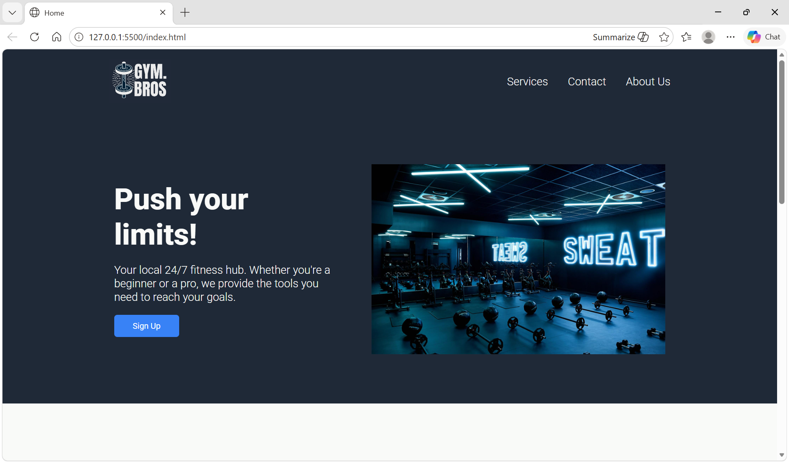

## FONT

LINK:

<link rel="preconnect" href="https://fonts.googleapis.com">
<link rel="preconnect" href="https://fonts.gstatic.com" crossorigin>
<link href="https://fonts.googleapis.com/css2?family=Inter:ital,opsz,wght@0,14..32,100..900;1,14..32,100..900&family=Kumbh+Sans:wght,YOPQ@100..900,300&family=Poppins:ital,wght@0,100;0,200;0,300;0,400;0,500;0,600;0,700;0,800;0,900;1,100;1,200;1,300;1,400;1,500;1,600;1,700;1,800;1,900&family=Roboto:ital,wght@0,100..900;1,100..900&display=swap" rel="stylesheet">

.roboto-<uniquifier> {
  font-family: "Roboto", sans-serif;
  font-optical-sizing: auto;
  font-weight: <weight>;
  font-style: normal;
  font-variation-settings:
    "wdth" 100;
}

## COLORS 

#1F2937
#E5E7EB
#F9FAF8
#3882F6

# GYM.BROS

A simple and responsive Gym Website created using HTML and CSS only.  

## 👥 Team Project

This website was created as a team project by me and my teammates.

## 📌 Project Overview

This website is designed for a fitness business and includes the main sections a user would need to explore the gym and sign up for membership.

## 🌐 Website Preview

## 🚀 Features

- Home Page – Welcoming landing page with introduction and highlights;
- Services Page – Displays gym services;
- Contact Page – Contains contact details and a contact section for users
- About Us Page – Information about the gym
- Sign Up Page – Allows users to register and join the gym

## 🛠️ Built With

- HTML5
- CSS3

## 📂 Pages Included

- `index.html` – Home page
- `services.html` – Services page
- `contact.html` – Contact page
- `about.html` – About Us page
- `sign-up.html` – Sign Up page

🎯 Purpose of the Project

The purpose of this project was to:

- Practice building a multi-page website
- Improve HTML structure and CSS styling skills
- Create a clean and user friendly gym website design
- Work collaboratively as a team on a project
